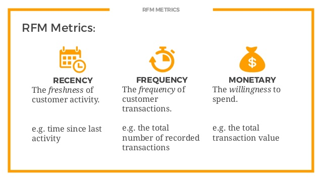
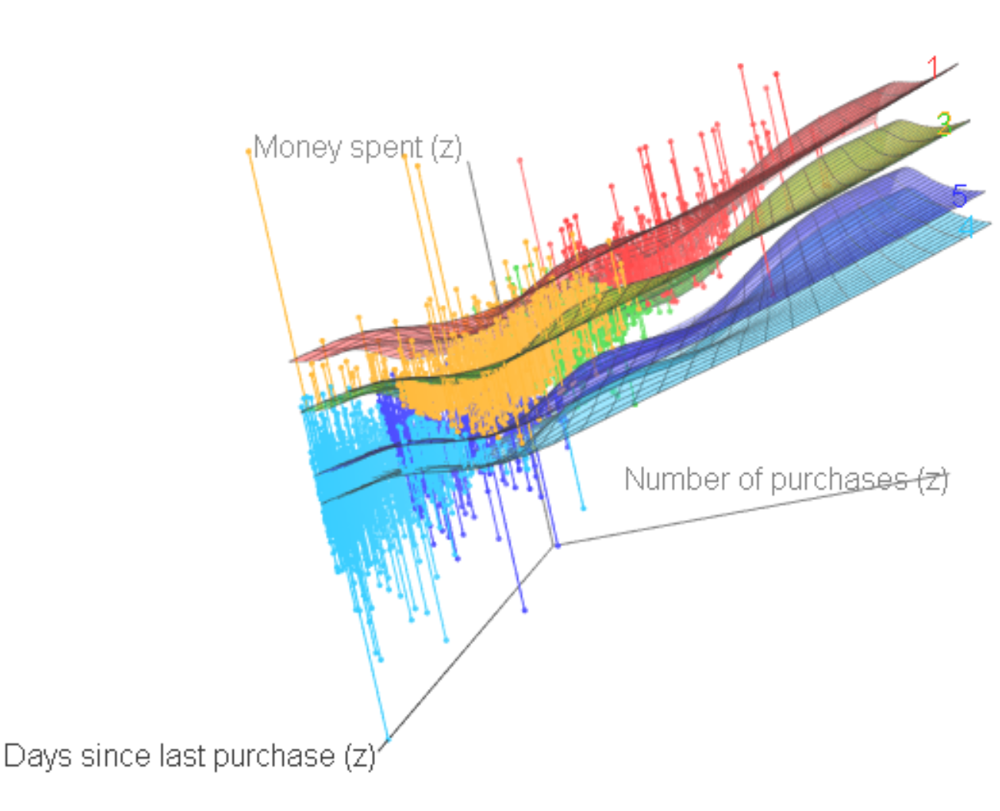

<style type="text/css">
.list-group-item.active, .list-group-item.active:focus, .list-group-item.active:hover {
    background-color: #003366;
    color:white;
}

</style>

<style>
.blue-outline {
   background-color: #9ecff7;
   padding:10px;
   display: inline-block;
}
</style>

<center></center>


# Introduction
 
## Overview
In this project, We will use a public dataset from UCI in order to explore the benefits of an unsupervised machine learning technique.

## Purpose
The main purpose of this project is to provide a better understanding to the businesses about the use of the clustering technique to gain insights than can improve customer loyalty, sales and profits.

# Data Understanding

## Setting libraries
Loading libraries for **data manipulation & visualization...**
```{r setting, eval=TRUE, warning = FALSE, message=FALSE}

library(factoextra)
library(NbClust)
library(cluster)
library(factoextra)
library(ggplot2)
library(corrplot)
library(animation)
library(readxl)
library(factoextra)
library(NbClust)
library(cluster)
library(factoextra)
library(ggplot2)
library(animation)
library(scales)
library(ExPanDaR)
library(knitr)
library(tidyverse)
library(lubridate)
library(lattice)
library(e1071)
library(scales)
library(caret)
library(rattle)
library(qwraps2)
library(ROCR)
library(countrycode)
library(tidyr)
library(DataExplorer)
library(corrplot)
library(corrr)
library(imputeTS)
library(fpp)
library(mice)
library(ggplot2)
library(highcharter)
library(gapminder)
library(magrittr)    
library(viridisLite)
library(countrycode)
library(DT)
library(cluster)
library(shiny)
library(car)
library(rgl)
library(gridExtra)
library(grid)


```
## Data Loading
Loading UCI **dataset...**
```{r loading2, eval=TRUE , warning = FALSE, message=FALSE}

# 1.1 Setting my working directory in R
setwd("C:/Saul/Portfolio/K-Means/KMeans") 
# 1.2 Reading the dataset
data.trx <-  data.frame(read_excel("Retail Transactions.xlsx", sheet="Transactions"))


```

## Data Exploring
```{r exploring, eval=TRUE , warning = TRUE, message=FALSE}

# 2.1 Data structure review
#str(data.trx)
# 2.2 Data preview

```
Checking a **sample data...**
```{r exploring0, fig.height=6, fig.cap ="" , eval=TRUE , warning = FALSE, message=FALSE}

datatable(data.trx[(1:50),], filter = 'top', options = list(
  pageLength = 25, scrollX = TRUE, scrollY = "300px", autoWidth = TRUE))

```
Checking **missing values...**

```{r exploring1, fig.height=6, fig.cap ="" , eval=TRUE , warning = FALSE, message=FALSE}

prepare_missing_values_graph(data.trx, ts_id = "Country")

```


```{r exploring2, fig.height=6, fig.cap ="" , eval=TRUE , warning = FALSE, message=FALSE}

plot_missing(data.trx)

```

Checking data through a **world map**
```{r exploring3, fig.height=6, fig.cap ="", eval=TRUE , warning = FALSE, message=FALSE}

countries <- data.trx %>% 
filter(!(Country %in% c("EIRE", "Unspecified","Channel Islands","European Community","RSA")))  %>% 
group_by(Country) %>% 
dplyr::summarise(total = n())
  

names(countries) <- c("country", "total")
countries$iso3 <-  countrycode(countries$country, origin = "country.name", destination = "iso3c")


data(worldgeojson, package = "highcharter")
dshmstops <- data.frame(q = c(0, exp(1:5)/exp(5)),
                        c = substring(viridis(5 + 1, option = "D"), 0, 7)) %>%  list_parse2()

highchart() %>% 
  hc_add_series_map(worldgeojson, countries, value = "total", joinBy = "iso3") %>% 
  hc_legend(enabled = TRUE) %>% 
  hc_add_theme(hc_theme_google()) %>% 
  hc_mapNavigation(enabled = TRUE) %>%
  hc_title(text = "Transactions per Country")  %>%
  hc_colorAxis(minColor = "#bed2e7", maxColor = "#003366") %>%
hc_tooltip(useHTML = TRUE, headerFormat = "", pointFormat = "{point.country}: {point.total} transactions")


```

```{r exploring4, fig.height=6, fig.cap ="Fig. 3", eval=TRUE , warning = FALSE, message=FALSE, include = FALSE}


# bar

foo <- head(countries[order(countries$total, decreasing= T),], n = 5)

p1 <- foo %>%
  mutate(percentage = str_c(as.character(round(total/sum(foo$total)*100,1)), "%")) %>%
  ggplot(aes(country, total, fill = country)) +
  geom_col() +
  geom_label(aes(label = percentage), color="black", fontface = "bold", position = position_dodge(width = 1)) +
  labs(x = "Countries", y = "Transactions") +
  theme(legend.position = "none", axis.text.x  = element_text(angle=15, hjust=1, vjust=0.9)) +
  ggtitle("Top 5 countries") +
  scale_fill_brewer(palette = "Blues")
theme_minimal()

```
Let's take a quick review using [Tableau](https://public.tableau.com/profile/saul.ventura#!/vizhome/DashboardUCLA/Dashboard1?publish=yes){target="_blank"}

```{r exploring5, fig.height=6, fig.cap ="Fig. 3", eval=TRUE , warning = FALSE, message=FALSE, include = FALSE}

# 2.3 Performing a descriptive statistics 
summary(data.trx)

```
# Data Preparation
## Scope
+ **<span style="color:black">Include only UK</span>**
+ **<span style="color:black">Remove guest customers</span>**
+ **<span style="color:black">Remove cancelled invoices</span>**
+ **<span style="color:black">Standarize data</span>**
+ **<span style="color:black">Use the RFM Model</span>**

<center></center>

## Processes
Performing **cleansing, formatting, normalization,...**
```{r preparation, eval=TRUE , warning = FALSE, message=FALSE, include = FALSE}

# 3. DATA PREPARATION

# RFM (Recency, Frequency, Monetary) analysis is a customer segmentation technique that uses past purchase behavior to divide customers into groups. 
# RFM helps divide customers into various categories or clusters to identify customers who are more likely to respond to promotions and also for future personalization services.
# 
# RECENCY (R): Days since last purchase
# FREQUENCY (F): Total number of purchases
# MONETARY VALUE (M): Total money this customer spent.

# 3.1  restricting the data to only United Kingdom customers
data.trx.uk <- subset(data.trx, Country == "United Kingdom")

# 3.2  removing canceled orders
data.trx.uk <- subset(data.trx.uk, Quantity > 0)
data.trx.uk <- subset(data.trx.uk, UnitPrice > 0)

# 3.3  removing customers with ID equal to NA
data.trx.uk <- subset(data.trx.uk, !is.na(data.trx.uk$CustomerID))

# 3.4  filtering the data to one full year 
summary(data.trx.uk)
# Max.   :2011-12-09 12:49:00

data.trx.uk <- subset(data.trx.uk, InvoiceDate >= "2010-12-09 12:49:00")
range(data.trx.uk$InvoiceDate)
# "2010-12-10 09:33:00 UTC" "2011-12-09 12:49:00 UTC"

# 3.5 Creating the RECENCY variable : Days since last purchase

temp <- subset(data.trx.uk)
temp$days.sl.pur <- as.Date("2011-12-10") - as.Date(data.trx.uk$InvoiceDate)
temp$purchase.invoice <- 1
recency <- aggregate(days.sl.pur ~ CustomerID, data=temp, FUN=min, na.rm=TRUE)
data.trx.uk <- merge(data.trx.uk, recency, by="CustomerID", all=TRUE, sort=TRUE) 
data.trx.uk$days.sl.pur <- as.numeric(data.trx.uk$days.sl.pur)


# 3.6 Calculate FREQUENCY of purchases as a new variable
customer.invoices <- subset(data.trx.uk, select = c("CustomerID","InvoiceNo"))
customer.invoices$purchase.invoice <- 1
customer.invoices <- customer.invoices[!duplicated(customer.invoices), ]
customer.invoices <- customer.invoices[order(customer.invoices$CustomerID),]
row.names(customer.invoices) <- NULL
annual.invoices <- aggregate(purchase.invoice ~ CustomerID, data=customer.invoices, FUN=sum, na.rm=TRUE)
names(annual.invoices)[names(annual.invoices)=="purchase.invoice"] <- "number.pur"
data.trx.uk <- merge(data.trx.uk, annual.invoices, by="CustomerID", all=TRUE, sort=TRUE) 

# 3.7 Calculate Monetary : Total money the customer spent

data.amount <- subset(data.trx.uk, select = c("CustomerID","InvoiceNo"))
data.amount$Amount <- data.trx.uk$Quantity * data.trx.uk$UnitPrice
annual.sales <- aggregate(Amount ~ CustomerID, data=data.amount, FUN=sum, na.rm=TRUE)
names(annual.sales)[names(annual.sales)=="Amount"] <- "money.spent"
data.trx.uk <- merge(data.trx.uk, annual.sales, by="CustomerID", all.x=TRUE, sort=TRUE)

customer.data <- subset(data.trx.uk, select = c("CustomerID", "days.sl.pur", "number.pur", "money.spent"))
customer.data <- customer.data[!duplicated(customer.data), ]

# customer.data <- customer.data[order(-customer.data$money.spent),]
#
# # Apply Pareto Principle (80/20 Rule)
pareto.cutoff <- 0.8 * sum(customer.data$money.spent)
customer.data$pareto <- ifelse(cumsum(customer.data$money.spent) <= pareto.cutoff, "Top 20%", "Bottom 80%")
customer.data$pareto <- factor(customer.data$pareto, levels=c("Top 20%", "Bottom 80%"), ordered=TRUE)
levels(customer.data$pareto)
round(prop.table(table(customer.data$pareto)), 2)
remove(pareto.cutoff)
customer.data <- customer.data[order(customer.data$CustomerID),]


# 3.8 Data standardization

hist(customer.data$days.sl.pur)
hist(customer.data$number.pur)
hist(customer.data$money.spent)

customer.data$days.sl.pur.z <- log(customer.data$days.sl.pur)
customer.data$number.pur.z  <- log(customer.data$number.pur)
customer.data$money.spent.z  <- log(customer.data$money.spent)


customer.data$days.sl.pur.z  <- scale(customer.data$days.sl.pur.z , center=TRUE, scale=TRUE)
customer.data$number.pur.z  <- scale(customer.data$number.pur.z , center=TRUE, scale=TRUE)
customer.data$money.spent.z  <- scale(customer.data$money.spent.z , center=TRUE, scale=TRUE)

hist(customer.data$days.sl.pur.z )
hist(customer.data$number.pur.z )
hist(customer.data$money.spent.z )

```

## Output {.tabset}

### Money Spent by Customers

```{r output1, eval=TRUE , warning = FALSE, message=FALSE}

df <- data.frame(customer.data)
ggplot(df, aes(x = money.spent.z)) +
  geom_histogram(bins = 20, fill="#08519C", alpha=1) +
  geom_vline(aes(xintercept=mean(money.spent.z)), ## straight line for the mean
             colour = "#ADFF2F", size=1.5, alpha=0.5) + 
  geom_vline(aes(xintercept=median(money.spent.z)), ## dashed line for the median
             colour = "#ADFF2F", linetype="dashed", size=1.5, alpha=0.5)

```

### Days Since Last Purchase

```{r output2, eval=TRUE , warning = FALSE, message=FALSE}

df <- data.frame(customer.data)
ggplot(df, aes(x = days.sl.pur.z)) +
  geom_histogram(bins = 20, fill="#08519C", alpha=1) +
  geom_vline(aes(xintercept=mean(days.sl.pur.z)), ## straight line for the mean
             colour = "#ADFF2F", size=1.5, alpha=0.5) + 
  geom_vline(aes(xintercept=median(days.sl.pur.z)), ## dashed line for the median
             colour = "#ADFF2F", linetype="dashed", size=1.5, alpha=0.5)

```

### Number of Purchases

```{r output3, eval=TRUE , warning = FALSE, message=FALSE}

df <- data.frame(customer.data)
ggplot(df, aes(x = number.pur.z)) +
  geom_histogram(bins = 20, fill="#08519C", alpha=1) +
  geom_vline(aes(xintercept=mean(number.pur.z)), ## straight line for the mean
             colour = "#ADFF2F", size=1.5, alpha=0.5) + 
  geom_vline(aes(xintercept=median(number.pur.z)), ## dashed line for the median
             colour = "#ADFF2F", linetype="dashed", size=1.5, alpha=0.5)

```

# Data Modeling

##K-Means
<center></center>

Basically, **it works like this...**
<center></center>

```{r modeling1, eval=TRUE , warning = FALSE, message=FALSE , include = FALSE}
#ANIMATION
# set.seed(2345)
# library(animation)
# ani.options(interval = 0.05)
# kmeans.ani(preprocessed[1:2], centers =3)
```
##Cluster Definition
Let's use some of the different techniques to find a **optimal** number of clusters.
```{r modeling2, eval=TRUE , warning = FALSE, message=FALSE}

# 4.1 Elbow method

set.seed(123)
# Compute and plot wss for k = 2 to k = 15
k.max <- 15 # Maximal number of clusters
data <- customer.data[,2:4]
wss <- sapply(1:k.max,
              function(k){kmeans(data, k, nstart=10 )$tot.withinss})
plot(1:k.max, wss,
     type="b", pch = 19, frame = FALSE,
     xlab="Number of clusters K",
     ylab="Total within-clusters sum of squares")
abline(v = 4, lty =2,col="royalblue")


# 4.2 Average Silhouette method

library(cluster)
k.max <- 10
data <- customer.data[,2:4]
sil <- rep(0, k.max)
# Compute the average silhouette width for
# k = 2 to k = 15
for(i in 2:k.max){
  km.res <- kmeans(data, centers = i, nstart = 25)
  ss <- silhouette(km.res$cluster, dist(data))
  sil[i] <- mean(ss[, 3])
}

# Plot the  average silhouette width
plot(1:k.max, sil, type = "b", pch = 19,
     frame = FALSE, xlab = "Number of clusters k")
abline(v = which.max(sil), lty = 2)

# 
# # 4.3 Gap Statistic method
# set.seed(123)
# data <- customer.data[,2:4]
# gap_stat <- clusGap(data, FUN = kmeans, nstart = 25,K.max = 10, B = 50)
# fviz_gap_stat(gap_stat)
# 
# 
# # 4.4 Using 30 different indexes
# set.seed(123)
# data <- customer.data[,2:4]
# res <- NbClust(data, diss=NULL, distance = "euclidean", min.nc=2, max.nc=10, method = "kmeans" , index = "all")
# fviz_nbclust(res) + theme_minimal()


```
##Processing
There is no a consensus regarding the number of clusters. Let's consider **5 clusters** and process our Kmeans model.
```{r modeling3, eval=TRUE , warning = FALSE, message=FALSE}


# 
# # 5. K-MEAN CLUSTERING
# 
# 5.1 fit the model and get cluster means
set.seed(123)
data <- customer.data[,6:8]
fit <- kmeans(data, 5, nstart = 20) 
aggregate(customer.data[,2:4],by=list(fit$cluster),FUN=mean) 

# 5.2 Display cluster centers and give a count of data points in each cluster
#fit$centers 
table(fit$cluster) 


```

# Results

##2D plot
Let's **visualize** the results when using 5 clusters
```{r results1, eval=TRUE , warning = FALSE, message=FALSE }

# 5.3 Plot the model
#clusplot(data, fit$cluster, color=TRUE, shade=TRUE, Expllabels=2, lines=0)

fviz_cluster(list(data = data, cluster = fit$cluster),
             frame.type = "norm", geom = "point", stand = FALSE)


fviz_cluster(fit, data = data)


# Add cluster membership to customers dataset
customer.data$cluster <- fit$cluster
customer.data$cluster  <- factor(customer.data$cluster, levels = c(1:5))


##2D plot
```

```{r results2, eval=TRUE , warning = FALSE, message=FALSE }
# 
# #######################
# # Plot clusters in 3D #
# #######################
# 
# colors <- c('red','orange','green3','deepskyblue','blue','darkorchid4','violet','pink1','tan3','black')
# scatter3d(x = customer.data$number.pur.z, 
#           y = customer.data$money.spent.z,
#           z = customer.data$days.sl.pur.z, 
#           groups = customer.data$cluster,
#           xlab = "Frequency (z)", 
#           ylab = "Monetary Value (z)",
#           zlab = "Recency (z)",
#           surface.col = colors,
#           box=FALSE,angle =80,
#           axis.scales = FALSE,
#           surface = TRUE, # produces the horizonal planes through the graph at each level of monetary value
#           fit = "smooth",
#           #     ellipsoid = TRUE, # to graph ellipses uses this command and set "surface = " to FALSE
#           grid = TRUE,
#           axis.col = c("black", "black", "black"))
# 
# 
# 
# 
# 
# scatter3d(x = customer.data$money.spent.z, 
#           y = customer.data$number.pur.z,
#           z = customer.data$days.sl.pur.z,
#           groups = customer.data$cluster,
#           xlab = "Monetary Value (z)", 
#           ylab = "Frequency (z)",
#           zlab = "Recency (z)",
#           surface.col = colors,
#           axis.scales = FALSE,
#           surface = TRUE, # produces the horizonal planes through the graph at each level of monetary value
#           fit = "smooth",
#           #     ellipsoid = TRUE, # to graph ellipses uses this command and set "surface = " to FALSE
#           grid = TRUE,
#           axis.col = c("black", "black", "black"))
# 
# <center></center>

```

    
##Labeling  
We will add the **labels** to the customers.
```{r labeling, eval=TRUE , warning = FALSE, message=FALSE }

count_cluster <- as.data.frame(table(fit$cluster))
colnames (count_cluster ) <- c("Group.1","Customers")
df <- aggregate(customer.data[,2:4],by=list(fit$cluster),FUN=mean) 
df <- merge (df, count_cluster, by = "Group.1")


colnames (df) <- c("Cluster","Days since last purchase","Number of purchases","Money spent","Customers")
df$`Days since last purchase` <- round(df$`Days since last purchase`)
df$`Number of purchases` <- round(df$`Number of purchases` )
df$`Money spent` <- round(df$`Money spent`)

d <- head(df)

tt3 <- ttheme_minimal(
  core=list(bg_params = list(fill = blues9[1:4], col=NA),
            fg_params=list(fontface=3)),
  colhead=list(fg_params=list(col="navyblue", fontface=4L)),
  rowhead=list(fg_params=list(col="orange", fontface=3L)))


grid.arrange(tableGrob(d, theme=tt3), nrow=1)


```

##Findings
Based on the results, some **strategies** should be applied to leverage the recent clustering process.

<center></center>

```{r labeling3, eval=TRUE , warning = FALSE, message=FALSE }
# test

```

#What is Next

+ **<span style="color:black">Explore more variables: first day of purchase, spent per category...</span>**
+ **<span style="color:black">Inventory segmentation</span>**
+ **<span style="color:black">Qualify the Suppliers</span>**
+ **<span style="color:black">Employee profiles</span>**

```{r next, eval=TRUE , warning = FALSE, message=FALSE }


```

#References

+ Ando K. (2018). Cluster Analysis of Whisky Reviews using k-means. Retrieved from https://www.kaggle.com/koki25ando/cluster-analysis-of-whisky-reviews-using-k-means
+ Black J. (n.d.). 3D scatter plot in R. Retrieved from https://epijim.uk/code-snippets/3Dscatter/
+ Bukun (2018). A Forty Kaggler. Retrieved from https://www.kaggle.com/ambarish/a-forty-kaggler
+ Chen D. (2012). Data mining for the online retail industry: A case study of RFM model-based customer segmentation using data mining. Journal of Database Marketing & Customer Strategy Management. Vol 19(3). 
+ Fox J. (n.d.). Three-Dimensional Scatterplots And Point Identification. Retrieved from https://www.rdocumentation.org/packages/car/versions/3.0-2/topics/scatter3d
+ GSD (2018). Who is a data scientist ?-A statistical approach. Retrieved from https://www.kaggle.com/gsdeepakkumar/who-is-a-data-scientist-a-statistical-approach
+ Hill A. (2018). 9 Useful R Data Visualization Packages for Any Discipline. Retrieved from https://blog.modeanalytics.com/r-data-visualization-packages/
+ Hirst T. (2015). Doodling With 3d Animated Charts in R. Retrieved from https://www.r-bloggers.com/doodling-with-3d-animated-charts-in-r/
+ Kassambara (2018). Cluster Analysis in R Simplified and Enhanced. Retrieved from https://www.datanovia.com/en/blog/cluster-analysis-in-r-simplified-and-enhanced/
+ Putler (n.d.). RFM Analysis For Successful Customer Segmentation. Retrieved from https://www.putler.com/rfm-analysis/#summary
+ Qiao F . (2018). Data Exploration and Visualization with R & ggplot. Retrieved from https://towardsdatascience.com/data-exploration-and-visualization-with-r-ggplot-7f33c10ec1c
+ Rezaeian A. (2016). Measuring Customers Satisfaction of ECommerce Sites Using Clustering Techniques: Case Study of Nyazco Website. International Journal of Management, Accounting and Economics. Vol 3(1).
+ Sarkar D. (2018). The Art of Effective Visualization of Multi-dimensional Data. Retrieved from https://towardsdatascience.com/the-art-of-effective-visualization-of-multi-dimensional-data-6c7202990c57
+ Stackoverflwo (2016). How to add table of contents in Rmarkdown?. Retrieved from https://stackoverflow.com/questions/23957278/how-to-add-table-of-contents-in-rmarkdown


```{r references, eval=TRUE , warning = FALSE, message=FALSE }

```


